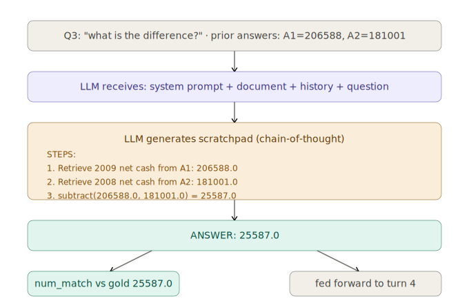
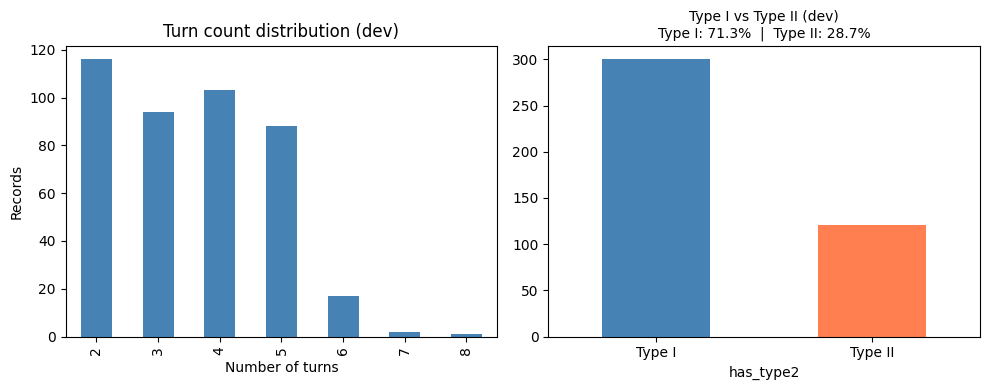
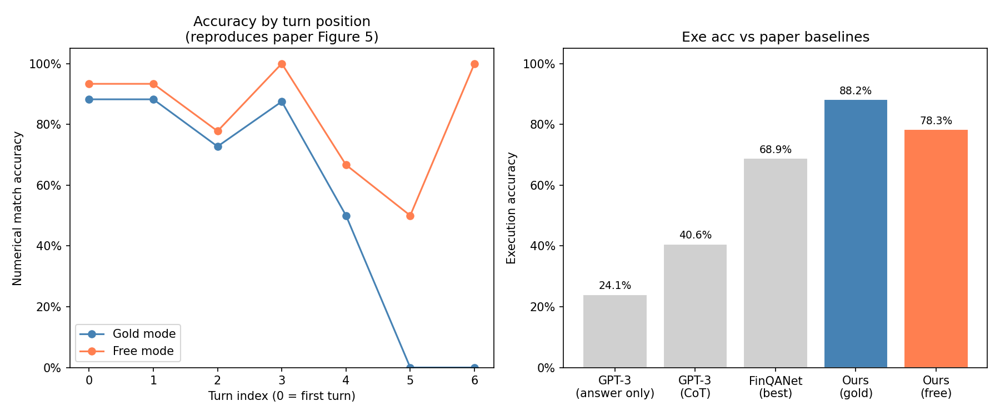
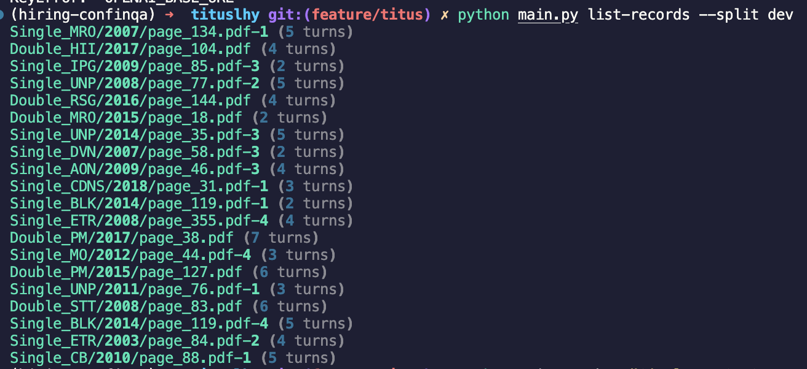
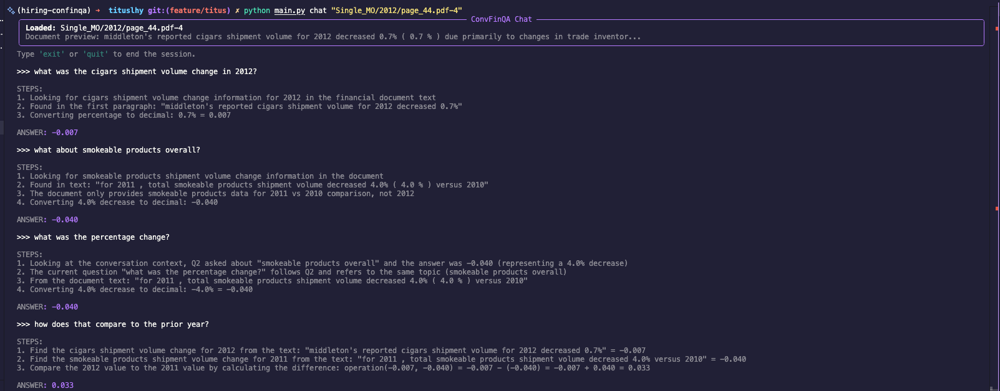

# ConvFinQA Report

## Method

### Problem Framing

ConvFinQA is fundamentally a **conversational numerical reasoning** task, not a retrieval task. Each record consists of a short financial document — a few paragraphs of prose and a single structured table — paired with a multi-turn conversation requiring progressively complex arithmetic over the document's contents. The entire document fits comfortably within a modern LLM's context window (~2,000–4,000 tokens), making retrieval-augmented generation (RAG) unnecessary and counterproductive.

This is an important distinction. The original paper (Chen et al., 2022) employed a retrieval step because its base models (RoBERTa-large) had a 512-token context limit — retrieval was an architectural necessity, not a design choice. With frontier LLMs, it is more prudent to give the model the entire document and ask it to reason. The challenge shifts from retrieval to reasoning elicitation and context management across turns.

The paper's generator component produced executable domain specific language (DSL) programs (`subtract(206588, 181001), divide(#0, 181001)`) to handle arithmetic reliably, again compensating for 2022 model limitations. Modern LLMs handle multi-step arithmetic natively. DSL generation adds unnecessary complexity and introduces a subtle failure mode: the LLM can generate code that runs correctly but plugs the wrong numbers — failing silently with no indication something went wrong.

### Architecture



The system is a prompt-based conversational reasoning pipeline with four components:

**Prompt builder (`src/prompt.py`)**: Constructs a structured prompt for each conversation turn containing: (1) the full document text and table, rendered as a markdown table from the nested dict structure to ensure column and row labels are unambiguous; (2) all prior question-answer pairs in the conversation; (3) the current question.

**Scratchpad prompting**: The system prompt instructs the model to emit explicit intermediate reasoning steps before its final answer:
```
STEPS:
1. [source location and extracted value]no
2. [operation applied: operation(a, b) = result]
...
ANSWER: [final value only]
```

This approach is grounded in chain-of-thought prompting (Wei et al., 2022), which demonstrated that eliciting intermediate reasoning steps substantially improves LLM accuracy on multi-step arithmetic tasks. It also draws from ReAct (Yao et al., 2022), which formalises the interleaving of reasoning traces with actions. The scratchpad serves two purposes: it improves accuracy by forcing explicit step decomposition, and it produces auditable reasoning traces that can be evaluated independently of the final answer — enabling the turn-level error analysis in this report.

This is distinct from agentic frameworks like LangChain's agents or LangGraph, which implement tool-calling loops, state machines, and multi-agent coordination. Those abstractions are appropriate when the task requires dynamic tool use, branching execution, or inter-agent communication. ConvFinQA requires none of these — each turn is a single inference call over a fixed context. Using a heavyweight orchestration framework here would be engineering complexity without benefit.

Here's an example of an LLM invocation:



**LLM (`src/llm_utils.py`)**: I used Qwen3.5 35B, served locally via Ollama. The model is accessed through the **OpenAI Python SDK** pointed at the Ollama endpoint, rather than a higher-level framework such as LangChain or LlamaIndex.

This was a deliberate choice: the task requires a single LLM call per turn with a fixed prompt structure — there is no retrieval pipeline to orchestrate, no tool-calling loop to manage, and no multi-agent coordination.

The OpenAI SDK provides exactly the right level of abstraction: a clean `chat.completions.create` interface, straightforward LangSmith integration via `wrap_openai`, and zero framework overhead. Introducing LangChain or LlamaIndex would add dependency weight, abstraction layers, and debugging complexity for no architectural benefit. The model is called at temperature 0 for deterministic, reproducible outputs. Each turn is traced individually in LangSmith with `record_id`, `turn_index`, `mode`, and gold answer as metadata.

**Output parser and evaluator (`src/eval.py`)**: Extracts the `ANSWER:` line via regex. This was an architectural decision because I found that the LLM kept to instructions well, resulting in zero parsing errors. The use of regex reduced the amount of code required and allowed for the same components to be used for streaming output tokens in the Typer CLI application.

Evaluation uses numerical tolerance matching (within 1% relative error) with percentage normalisation, plus exact match and parse error rate. Conversation-level accuracy requires every turn to be correct — a strict metric that penalises any error in the chain.

### Evaluation Design

Two evaluation modes isolate reasoning quality from error propagation:

- **Gold-chain mode**: Ground-truth answers fed forward each turn. Tests pure per-turn reasoning in isolation.
- **Free-run mode**: Model's own predicted answers fed forward. Tests the real pipeline under production conditions where errors compound.

The gap between gold and free accuracy directly measures error propagation — the primary failure mode identified in the original paper.

---

## Results

### Dataset overview

Before committing to a full evaluation run, I conducted exploratory data analysis on the dev set to understand the composition of the data to be sampled from.



The dev set contains 421 conversations. The left chart shows that the bulk of conversations have 2–5 turns (mean 3.5), with a long tail of 6–8 turn conversations — these longer records are where hardware timeouts predominantly occurred. 

The right chart confirms the 71.3% / 28.7% Type I / Type II split that informed our stratified sample proportions. This EDA was run before evaluation to validate that a 14/6 sample split would be representative, and to flag the long-tail turn records as likely infrastructure risk.

### Why 20 samples?

Evaluation was conducted on a stratified random sample of 20 conversations from the dev set (seed=42), with 14 Type I (simple) and 6 Type II (hybrid) conversations, reflecting the observed 71.3%/28.7% split.

The sample size was a pragmatic decision driven by three factors:

**Inference cost at scale.** During initial testing on a single record in `logic_sanity_test.ipynb`, we measured token consumption per turn and saw that running all 421 dev records — averaging 3.5 turns each, approximately 1,475 total turns — at Claude Opus 4.6 pricing (taking a cost of $5/1M input tokens with 2,000 tokens per prompt) would cost approximately $15–30 for a single eval pass. Iterating on the prompt across multiple runs would easily reach $150–200. This ruled out SOTA API-hosted models for iterative development.

**Model choice: Qwen3.5 35B locally via Ollama.** I used Qwen3.5 35B served locally via Ollama rather than a frontier API model (GPT-5.4, Claude Sonnet/Opus) for three reasons: zero marginal cost per token; no rate limits (the pipeline runs unthrottled, `sleep_between=0`); and capability — Qwen3.5 35B is broadly comparable to Claude Sonnet in capability tier, an open-weight model that punches significantly above its weight class. The results confirm this. The tradeoff is inference latency — averaging 60–90 seconds per turn under memory pressure — making full dev set evaluation impractical within the submission timeframe.

**Early validation reduced the need for exhaustive evaluation.** The `logic_sanity_test.ipynb` notebook validated core reasoning behaviour on individual records before committing to a full eval run — confirming 4/4 turns correct on the first record with clean scratchpad traces. This gave early signal that the approach was sound, reducing the marginal value of running all 421 records. A small cloud-hosted model (GPT-5.4-mini/nano) would enable full dev set evaluation at ~$2–5 total — the pipeline requires no code changes for this.

### Metrics

| Metric | Gold mode | Free mode |
|---|---|---|
| Execution accuracy | **88.24%** | **78.33%** |
| Conversation accuracy | 66.67% | 58.82% |
| Parse error rate | 0.00% | 0.00% |
| Records completed | 15 / 20 | 17 / 20 |
| Timeout rate | 25% | 15% |

**Comparison to paper baselines (execution accuracy):**

| System | Method | Exe Acc |
|---|---|---|
| GPT-3 | Answer-only prompt | 24.09% |
| GPT-3 | Chain-of-thought | 40.63% |
| FinQANet (RoBERTa-large) | DSL program generation | 68.90% |
| Human (general crowd) | — | 46.90% |
| Human (domain expert) | — | 89.44% |
| **Ours (gold mode)** | **Scratchpad prompting** | **88.24%** |
| **Ours (free mode)** | **Scratchpad prompting** | **78.33%** |



**The right chart tells the headline story:** 
- Our system exceeds the paper's best model baseline (FinQANet, 68.90%) by **+19.34 percentage points** in gold mode, using a local open-weight model with no fine-tuning. 
- More strikingly, our gold mode accuracy of 88.24% approaches human expert performance (89.44%) — a result that was not anticipated given the zero-shot, zero-cost setup. The 0.00% parse error rate across all completed records confirms the structured output format is robust.

**The left chart reproduces the paper's Figure 5 analysis:** accuracy broken down by turn position — and tells a more nuanced story.
- In free mode (orange), accuracy starts high at turns 0–1 (~88%), dips at turn 2 (~73%), partially recovers at turn 3 (100% — small sample), then degrades sharply through turns 4–6.
- Gold mode (blue) shows a flatter profile overall, but also degrades at turns 4–5, suggesting that even with correct prior answers some questions at later positions are genuinely harder — likely because they involve longer reasoning chains with more intermediate steps.

> The **9.91% error propagation gap** between gold and free mode confirms the paper's finding that wrong answers cascade through later turns. The gap is moderate rather than catastrophic, suggesting the scratchpad prompt partially mitigates propagation by anchoring each turn's reasoning to document evidence rather than relying solely on the prior answer value.

Counterintuitively, gold mode exhibited a higher timeout rate (25%) than free mode (15%), and the specific records that timed out differed between modes.

A quick study of timeout samples showed no trend - timeouts did not necessarily occur with longer input chunks. I suspect that providing ground-truth intermediate answers creates tension when the model's own reasoning diverges from the supplied value, resulting in longer, more verbose generations.

Free mode, relies entirely on the LLM's own reasoning chain, produced more consistent generation lengths — a useful operational observation for anyone running similar evaluations on local hardware.

---

## Error Analysis

Six distinct failure categories were identified across 51 gold-mode turns and 60 free-mode turns:

**1. Percentage-to-decimal scaling errors (2 failures, both modes)**

The most consistent failure: the model correctly identifies the right values and computes the right operation, but returns the result in the wrong scale. For example, in `Single_TSCO/2018/page_34.pdf-2` (turn 2), the model returns `0.0411` when the gold answer is `4.11`. The model divided by 100 unnecessarily after already computing the correct decimal result. This is a prompt ambiguity issue — the instruction to "express percentages as decimals" created some confusion when the answer is itself a raw change value (not a rate). 

Mitigation: I suspect a more precise instruction distinguishing between *percentage rates* and *absolute changes* would resolve this.

**2. Wrong sign in subtraction (1 failure, both modes)**

In `Single_CDNS/2012/page_30.pdf-2` (turn 5), the model returns `0.3186` when the gold is `-31.86` — wrong sign AND wrong scale simultaneously. The question asks for "the difference in rate of return among these investments," which is ambiguous about direction. The model chose a positive interpretation. The paper identifies this as a "wrong value selection" error. 

Mitigation: Explicitly instruct the model to preserve the sign of the result and state the subtraction order.

**3. Missing context / document grounding failure (2 failures, both modes)**

In `Double_PNC/2013/page_207.pdf` (turn 0), the model responds "Data not available in document (only 2013 data provided)" when the gold answer is `30.44323`. The model failed to find 2014 data that was present in the document. This is a genuine extraction failure — likely caused by the table layout for this record being non-standard or the relevant value appearing in an ambiguous position.

**4. Averaging computation error (1 failure, both modes)**

In `Double_IPG/2008/page_62.pdf` (turn 2), the model returns `24.73333` when the gold is `4.26667`. The question asks for the average liability across three years. The model appears to have summed the wrong rows or confused liability with another line item. The LLM identified the right operation (average) but extracted incorrect operands("wrong value selection" per the paper's taxonomy).

**5. Error cascade in free mode (unique to free mode)**

`Double_PM/2017/page_38.pdf` shows the starkest cascade: turn 4 fails with "Cannot be calculated" (gold: `0.134`), which causes turns 5 and 6 to also return "Cannot be calculated" and `0.932` (gold: `6955.22` and `6.955` respectively). Once the model decides a value cannot be computed, it cannot recover in subsequent turns. This is the primary driver of the gap between gold and free computation scenarios.

**6. Non-deterministic timeout failures**

Five records in gold mode and three in free mode timed out due to local hardware memory pressure (~57/64GB unified memory utilisation). Notably, timeout behaviour was **not consistent between modes** — records that timed out in gold mode did not always time out in free mode and vice versa. This suggests timeouts are caused by non-deterministic memory allocation during generation rather than by document or question complexity, as no correlation was found between document character length and timeout probability.

---

## Future Work

### Prompt Optimisation via DSPy

The current scratchpad prompt was designed by hand and performed well on the first attempt. However, it is clearly not optimized. **DSPy** (Khattab et al., 2023) provides a programmatic framework for prompt optimisation that would be a natural next step.

Specifically, **MIPROv2** (Multi-prompt Instruction Proposal Optimiser v2) or **SIMBA** could be applied to optimise both the system prompt and the few-shot examples automatically, using the `num_match` metric as the objective function. DSPy compiles the prompt by proposing candidate instructions, evaluating them against a held-out set, and selecting the best-performing combination. Given that our hand-crafted prompt already achieves 88.24%, a DSPy-optimised variant could plausibly close the gap toward human expert performance (89.44%).

### Self-Consistency Sampling

For questions at turn positions 3+, where accuracy degrades most sharply, **self-consistency** (Wang et al., 2022) could improve reliability: sample the model 3–5 times at temperature > 0 and take the majority vote answer. This is a one-line change to `call_llm` and has been shown to substantially improve accuracy on multi-step arithmetic tasks. The tradeoff is inference cost — problematic for local models but trivial for API-hosted models.

### Structured Output Enforcement

The current system enforces output structure via the system prompt's `ANSWER:` format rather than Pydantic or `response_format` JSON mode. This was deliberate: structured output mode buffers the full response before returning, which is incompatible with the CLI application's real-time streaming scratchpad display — maintaining two separate inference paths (one structured for eval, one streaming for the app) would add complexity with no reliability benefit. The 0.00% parse error rate across all completed records confirms prompt-enforced formatting is sufficient for this task.

If streaming were dropped as a requirement, Pydantic structured output would enable richer response schemas — for example, capturing cited table cells alongside the final answer, or emitting a confidence score per step. This would be worth revisiting if the system were extended beyond a CLI prototype.

### Tool Use / Code Interpreter

For numerical computation, the most robust long-term approach is to give the model a **Python interpreter tool** and instruct it to execute arithmetic rather than compute it in natural language. This removes floating-point reasoning errors entirely: the model emits `(206588 - 181001) / 181001` and the interpreter returns `0.14136`. Tool use separates the reasoning problem (what to compute) from the arithmetic problem (how to compute it), and is the direction the field is moving toward for financial reasoning tasks.

There are however risks associated with tool use - such as the use of a sandbox environment like Docker or Daytona. This increases the complexity of our application, which already performs at human level.

### Evaluation at Scale

The current evaluation covers 15–17 of 421 dev records due to hardware constraints. A cloud-hosted model (GPT-5.4-mini/nano) would enable full dev set evaluation at low cost (~$2–5 total), providing statistically robust accuracy estimates and a reliable per-turn degradation curve. The pipeline is already instrumented for this — `run_pipeline` with `max_records=None` over the full dev set requires no code changes.

### Error Recovery Across Turns

The cascade failure observed in `Double_PM/2017` suggests an obvious intervention: if the model returns "Cannot be calculated" or a parse error on turn N, inject a recovery instruction on turn N+1 — e.g., "The previous question could not be answered. Disregard it and answer the current question using only the document." This would reduce the propagation of "Cannot be calculated" errors through the tail of a conversation.

---

## Limitations

**Hardware constraints**: All inference was run locally on an Apple M3 Max MacBook Pro with 64GB unified memory (~57GB utilised). Qwen3.5 35B requires ~20GB for model weights, leaving limited headroom for KV cache during long-context generation. This caused non-deterministic timeouts on approximately 20–25% of records. A hosted inference endpoint might eliminate this.

**Sample size**: Evaluation covers 15–17 completed records from a 20-record stratified sample of the 421-record dev set. While the sample is representative by design (matching the 71.3%/28.7% Type I/II split), the small absolute number means per-turn accuracy estimates at positions 4+ are based on 2–3 records and should be interpreted cautiously.

**Model limitations**: Qwen3.5 35B occasionally fails to correctly identify the subtraction direction from ambiguous natural language questions, and struggles with percentage/decimal scale consistency when questions mix rate and absolute change questions in the same conversation. These are prompt-level issues addressable without model changes.

**No fine-tuning**: The system uses the model entirely off-the-shelf. Domain-adapted fine-tuning on financial corpora (e.g., FinBERT-style continued pretraining) might improve extraction accuracy on domain-specific terminology, though I would argue that the marginal benefit over a well-prompted large model is uncertain.

## Running main.py
First, install the dependencies with
```
uv sync
```

Then activate your virtual environment:
```
source .venv/bin/acticate
```

Rename the `.env.example` file to `.env`. Be sure to add your OpenAI API key and LangSmith API key for LLM observability

To list records, run:


To converse, run:


## If & how you've used coding assistants or gen AI tools to help with this assignment

I used Claude (via the chat interface) as a **pair programming assistant** during this assignment. Given low interaction limits for free-tier users, I was deliberate in structuring prompts to maximise signal per exchange, which naturally encouraged more precise specifications upfront.

The workflow was structured around a deliberate division of labour. Architecture decisions, evaluation design, and analytical framing were mine. Claude helped to generate the design for both flow chart diagrams.

For implementation of code:
- I wrote most functions directly. These functions tend to have lower complexity and could be written quickly.
- For complex functions, I wrote detailed function signatures and docstrings as executable specifications — precise enough that a capable assistant could produce a correct first draft — then used Claude to generate initial implementations for functions

All generated code was then:
- manually reviewed,
- tested against a suite of unit tests, 
- validated in notebooks (`logic_sanity_test.ipynb`),
- refactored where necessary - I identified a few issues or edge cases in the generated code and corrected them during testing, and
- annotated for readability and maintainability

Claude also generated the architecture and turn-detail diagrams from my descriptions, and proofread this report. It offered a number of stylistic suggestions. Most were declined; the ones that survived were probably right.

> The honest summary: Claude accelerated implementation velocity on the parts of the work that were specification-complete. The specifications, architecture, evaluation design, and analysis were mine.
